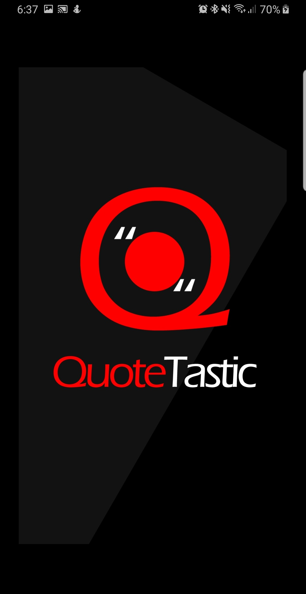
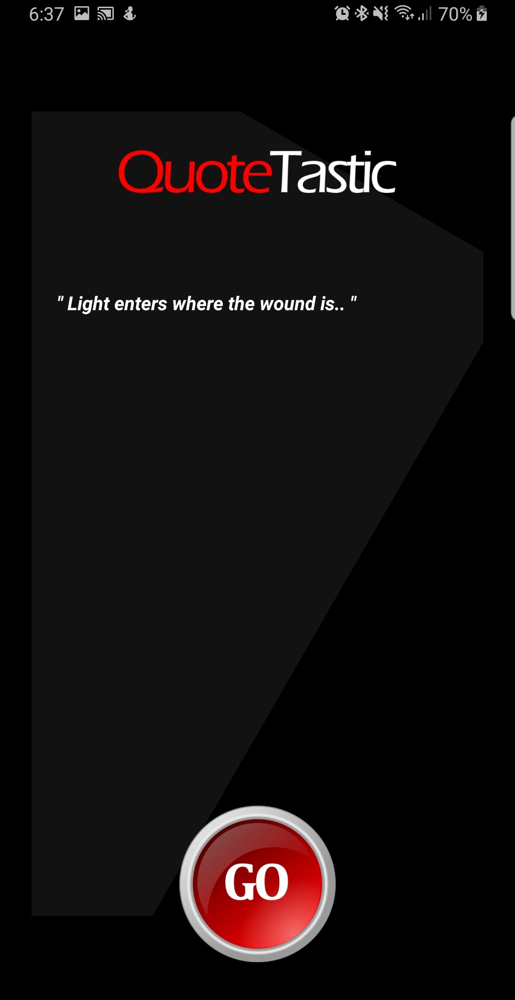

# QuoteTastic
A simple, inspirational Android application designed for beginners. It displays a variety of quotes to inspire users. The application achieves this by storing quotes in a local SQLite database and presenting them randomly to the user upon interaction.

Features:
- Random Quote Display: Upon a button click, the application displays a random quote from the database to the user.
- Quote Detail View: Users can view detailed information about the quote, including its author and a description.
- Data Persistence: Quotes are stored in a local SQLite database, ensuring that they persist across app launches.

Technical Details:
- Programming Languages: Java
- Front-end Technologies: Android XML for layout designs
- Mobile Development: Android development
- Database Technologies: SQLite is used for local data storage.

 
